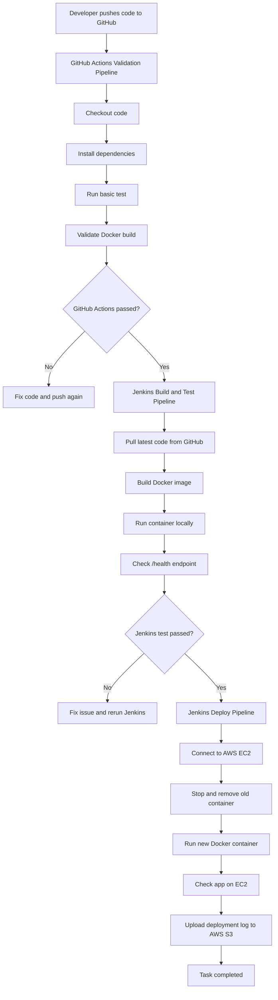

# TC
# Task  - 1

# Create **3 pipelines** to validate CI/CD using **GitHub Actions, Jenkins, Docker, AWS EC2, and AWS S3**.

Build a simple web application, create Docker image, test it, deploy it on EC2, and upload logs to S3.

---

# What to Build

Build a simple web app with one endpoint:

```
/health
```

Expected output:

```json
{
  "status": "UP",
  "message": "App is running"
}
```

---

# Where to Use GitHub Actions

Use **GitHub Actions** for the first-level validation.

GitHub Actions should run when code is pushed to GitHub.

Use GitHub Actions for:

```
Code checkout
Install dependencies
Run basic test
Validate Docker build
```

Purpose:

```
GitHub Actions will check whether the code is valid before Jenkins deployment starts.
```

---

# Where to Use Jenkins

Use **Jenkins** for the main CI/CD pipeline and deployment.

Jenkins should run after GitHub Actions passes.

Use Jenkins for:

```
Pull latest code from GitHub
Build Docker image
Run container test
Deploy Docker container to AWS EC2
Upload deployment log to AWS S3
```

Purpose:

```
Jenkins will handle build, test, deployment, and artifact upload.
```

---

# Pipeline 1: GitHub Actions Validation Pipeline

Create this pipeline in GitHub Actions.

It should do:

```
Checkout code
Install dependencies
Run basic test
Validate Docker image build
```

Output:

```
GitHub Actions should pass successfully
```

---

# Pipeline 2: Jenkins Build and Test Pipeline

Create this pipeline in Jenkins using Jenkinsfile.

It should do:

```
Pull latest code from GitHub
Build Docker image
Run Docker container locally
Check /health endpoint
```

Output:

```
Docker image should build successfully
Application health check should pass
```

---

# Pipeline 3: Jenkins Deploy Pipeline

Create this also in Jenkins using Jenkinsfile.

It should do:

```
Connect to AWS EC2
Stop old container
Remove old container
Run new Docker container
Check application on EC2
Upload deployment log to AWS S3
```

Output:

```
Application should run on EC2
Deployment log should be uploaded to S3
```

---

# Flow Diagram



---

# Deliverables

Submit:

```
GitHub repository link
Application source code
Dockerfile
GitHub Actions workflow file
Jenkinsfile
Screenshot of GitHub Actions validation pipeline
Screenshot of Jenkins build and test pipeline
Screenshot of Jenkins deploy pipeline
EC2 public IP or URL
Screenshot of application running on EC2
Screenshot of deployment log uploaded in S3
README file with steps
```

---

# Tips and Tricks

Keep the app simple.

Use GitHub Actions only for validation before deployment.

Use Jenkins for actual build, test, deploy, and S3 upload.

Do not store AWS keys, SSH keys, or passwords in code.

Use GitHub Secrets for GitHub Actions.

Use Jenkins Credentials for AWS and EC2 access.

Use clear Docker image tags:

```
app-name:build-number
app-name:git-commit-id
```

Test Docker locally before deploying:

```bash
docker build -t myapp .
docker run -p 8080:8080 myapp
curl http://localhost:8080/health
```

On EC2, stop old container before starting new one:

```bash
docker stop myapp || true
docker rm myapp || true
```

Upload deployment log to S3:

```bash
aws s3 cp deployment.log s3://bucket-name/logs/build-${BUILD_NUMBER}.log
```


# Solution Of TASK:
  # Setups Of TASK:
1. install jenkins on EC2 server
2. create one more EC2 for agent node and configred the setups of multi-node
     # labes use in setup:
         1. master node labels used: "master"
         2. worker node labels used: "node"
4. wherever we deploying the code, java-17 is to be installed on that server
5. install docker on each server user "sudo apt update && sudo apt installe docker.io -y"
6. aws cli is to be installed on each server (mainly on deployment server becasue from there logs pushing to s3 using aws cli command)
7. setup maven from jenkins --> manage jenkins --> tools--->maven --> use name "maven3" ---> click on auto install
8. setup java from jenkins --> manage jenkins --> tools --> jdk --> use name "jdk17" ---> paste this path "/usr/lib/jvm/java-17-openjdk-amd64"
9. create s3 buket in sydney "ap-southeast-2" with name "test-jenkins-tc"
10. create job in jenkins with name (from github actions workflow triggering --->  CICD)
        1. CICD

 # credential setup Of TASK for jenkins:
 1. Store docker hub credential details in jenkins credential-plugins andd use credential-id: docker-token,  to push docker image to docker hub 
 2. Store Access_key and Private_key in crdential-plugin and use credentialsId: aws-access-key, credentialsId: aws-secret-key, to push logs to s3 buket
 3. generete jenkins token , click on profile --> security ---> API Token ---> Add new Token ---> paste jenkins token ---> click on generet

# credential setup Of TASK for github:
All these data is used to trigger jenkins from github Actions workflows.... 
 1. add jenkins url with name JENKINS_URL in github secertes
 2. add jenkins username with name JENKINS_USERNAME in github secertes
 3. add jenkins API Token with name JENKINS_TOKEN in github secertes
